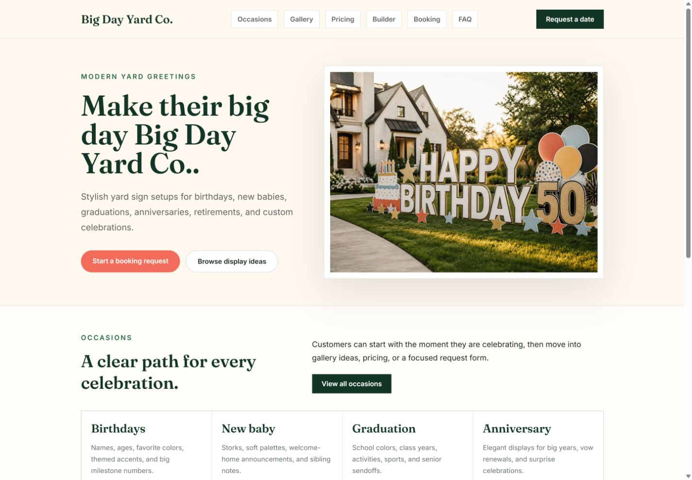
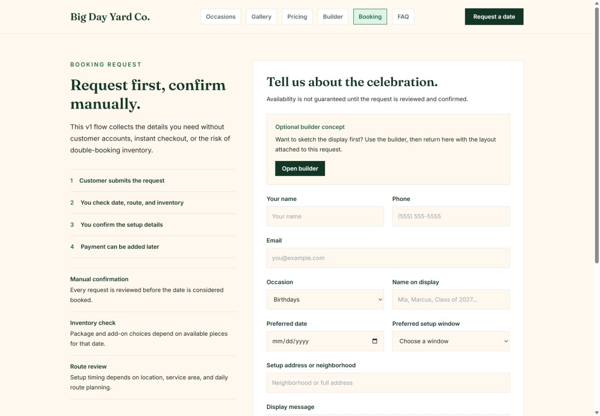
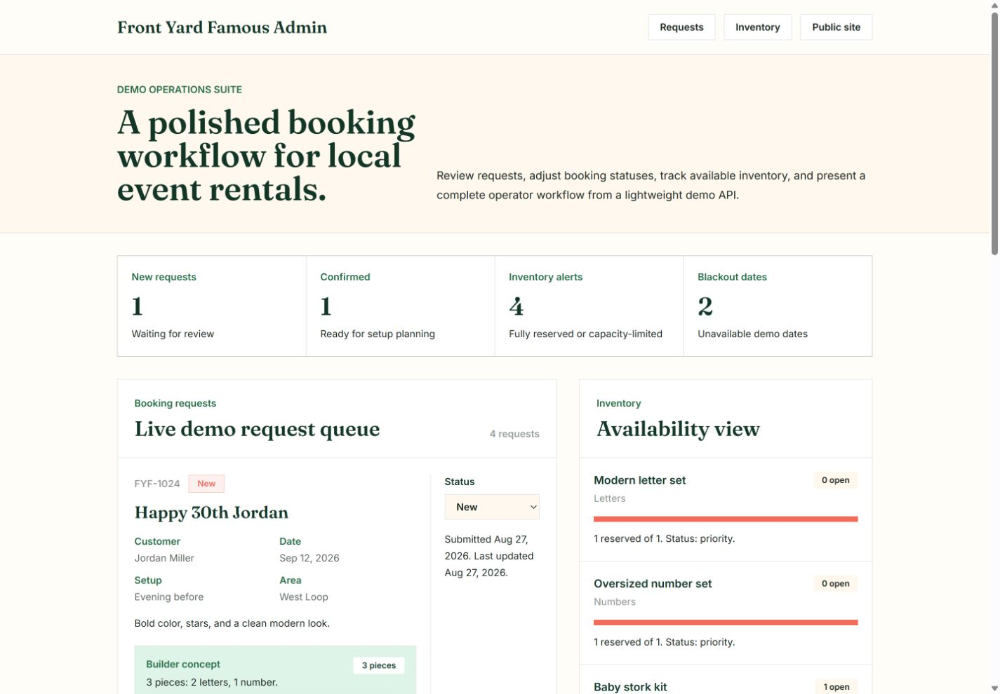
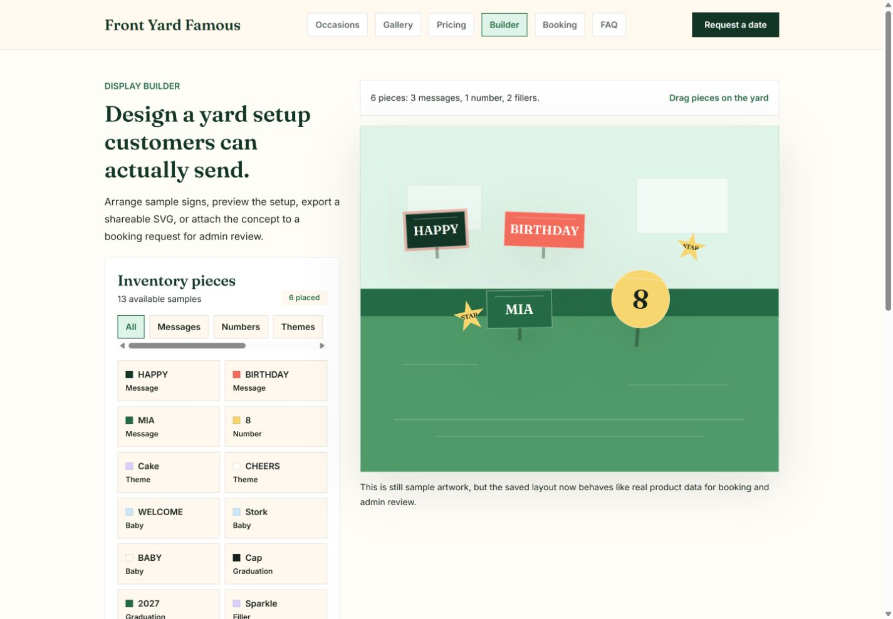
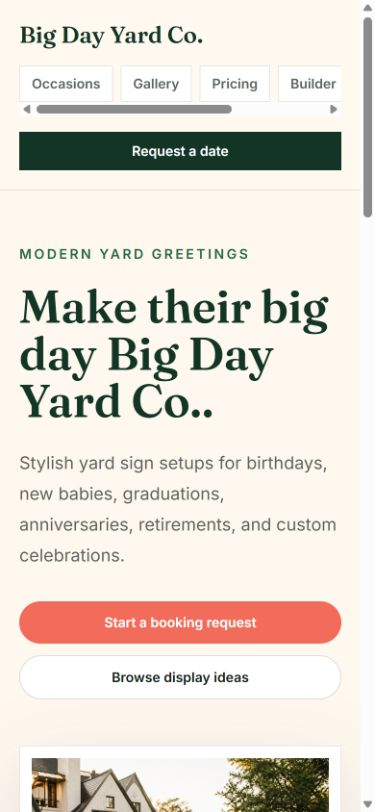
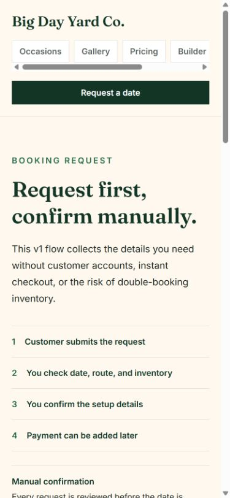
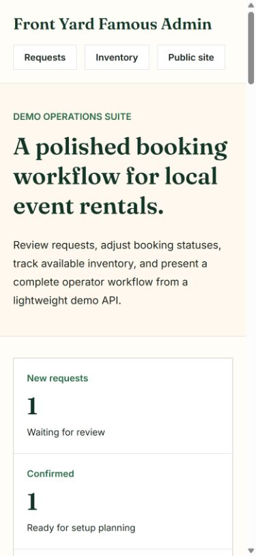
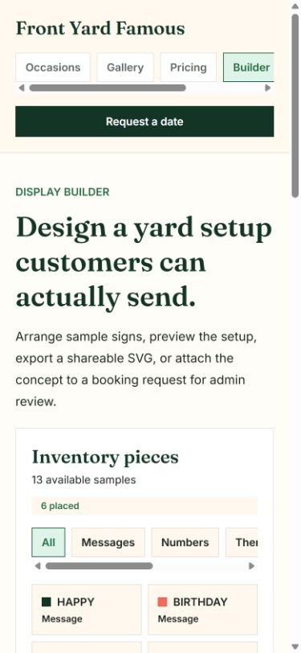

# Front Yard Famous Case Study

## Overview

Front Yard Famous is a modern booking and operations demo for a local celebration display business. It presents yard greetings, storks, milestone numbers, and themed display setups through a cleaner product experience than the crowded one-page sites common in the category.

## Problem

Many local yard sign businesses rely on outdated pages with dense copy, inconsistent visuals, and limited booking clarity. Customers need a simple way to understand occasions, browse display ideas, compare starting packages, and submit a request. Operators need a lightweight way to review requests and reason about inventory without committing to a full commerce stack too early.

## Solution

The project separates the customer and operator experiences:

- A focused public site with routes for home, occasions, gallery, pricing, booking, and FAQ.
- A booking inquiry flow that validates customer details and posts to a local API.
- A polished builder workflow where customers arrange sample yard display pieces, export a preview, and attach that layout to a booking request.
- An admin dashboard with seeded demo bookings, status updates, inventory availability, package data, and blackout dates.
- Launch-ready metadata, sitemap, robots file, favicon, manifest, and Vercel routing configuration.

## Product Highlights

- Premium visual direction for a celebration-oriented local business.
- Clean navigation instead of one long, crowded homepage.
- Manual booking confirmation model, which avoids premature payment/account complexity.
- API-backed admin workflow that demonstrates full-stack thinking.
- Resettable demo data for portfolio walkthroughs and buyer presentations.
- Interactive builder workflow that carries customer layout concepts and visual previews into admin review.

## Technical Highlights

- React and TypeScript frontend built with Vite.
- Tailwind CSS for responsive visual design.
- Node HTTP API using built-in modules.
- Local JSON persistence for a deployable demo without paid database infrastructure.
- Node test runner coverage for validation, booking routes, seeded demo data, status updates, and inventory endpoints.

## Demo Screenshots

Captured during Stage 10.5 and Stage 11A visual QA:

## What I Would Add Next

- Hosted demo backend or mocked hosted API responses.
- Playwright browser smoke tests.
- Optional admin authentication for a more production-like demo.
- Real inventory artwork uploads and hosted preview-image storage.
